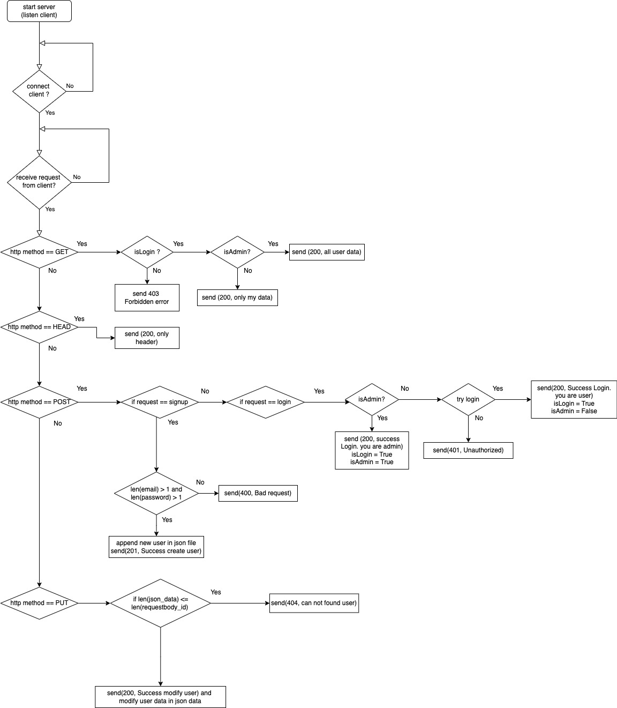

# cumputer network first project (develop socket connection)

**_이번 프로젝트 과제_** 는 socket 통신을 구현하여 지정된 기능들을 구현해야한다. Python에서 제공하는 socket 라이브러리를 이용하여 구현하였고, **json 파일을 이용한 파일 입출력**과  **클라이언트가 request 를 보냈을 때 서버가 동작**을 하는것을 보여준다.

## 🚀 과제 목표
1. Server side : 유저 정보를 저장하고 유저의 권한에 따라 다른 정보를 제공할 수 있는 API가 구현 되어야 한다.
2. Client side : API를 요청할 수 있는 기능(fetch)이 구현되어야 한다.

## 📈 순서도


---

## 🖥 동작환경
<table>
<tbody>
    <tr>
        <td>
            <div align="center">
                <a href="https://www.python.org/" target="_blank"> 
                     
                </a>
                <br>server : mac os</br></div>
        </td>
        <td>
            <div align="center">
                <a href="https://babeljs.io/" target="_blank">  
                </a>
                <br>client : windows10</br>
            </div>
        </td>
</tbody>
</table>

---

## 🧚🏻‍♀️ 핵심 모듈

<table>
<tbody>
    <tr>
        <td width="60">
            <div align="center"><a href="https://www.python.org/" target="_blank">  </a><br>Python3</br></div>
        </td>
        <td>
            <div align="center"><a href="https://babeljs.io/" target="_blank">  
            </a><br>Python Socket</br></div>
        </td>
        <td>
            <div align="center"><a href="https://docs.python.org/ko/3/library/json.html" target="_blank">  
            </a><br>Python Json</br></div>
        </td>
</tbody>
</table>

---

## 👩‍💻 기능 & 라우트 명세

### - ROUTE
- 127.0.0.1 : root and request path

### - HTTP METHOD

#### 1. POST
- 200(login Success) : user json file에서 사용자의 아이디와 비밀번호를 받아 로그인 성공 정보와 권한 정보를 반환한다. (권한 정보 : 1. 관리자 / 2. 일반 유저)
- 401(login Fail) : 등록되지 않은 유저정보로 로그인을 시도할 경우 401을 반환한다.

#### 2. GET
- 200 (Success) 권한이 관리자일 경우 : user json file에서 지금까지 저장된 회원 정보를 반환한다. 
- 200 (Success) 권한이 일반 유저일 경우 : user json file에서 본인의 정보만 반환한다. 
- 403(Forbidden) : 로그인이 되지 않은 클라이언트가 요청할 시 403을 반환한다..

#### 3. PUT
- 201 (Create Success) : 새로운 유저 정보를 user json file에 추가한다.
- 400 (Bad request) : 이메일 혹은 패스워드의 길이가 1이하일 경우 400을 반환한다.

#### 4. HEAD
- 200(Success) : server의 현재 상태를 반환한다.

---

## 🌠 실행 결과 (media 폴더에 사진 원본이 있습니다.)

- 시연영상 <br>
https://drive.google.com/file/d/1JNYEhKIRmWh_NpFFiZFYKInnsjCtHXjh/view?usp=sharing

와이어샤크를 이용하여, syn bit를 시작으로 tcp 연결 후 fin bit를 이용하여 연결을 끊는 장면이 포함되어 있습니다. 

- POST (login) <br>
<table>
	<tbody>
		<tr>
            <td rowspan="6">
                <div align="center">
                    
                    
                </div>
            </td>
            <td width="33%"></td>
        </tr>
        <tr>
            <td>로그인 기능</td>
        </tr>
        <tr>
            <td>전송된 이메일에 따라 admin인지 user인지 판별</td>
        </tr>
    </tbody>
</table>

- GET (get user data) <br>
<table>
	<tbody>
		<tr>
            <td rowspan="6">
                <div align="center">
                    
                    
                </div>
            </td>
            <td width="33%"></td>
        </tr>
	<tr>
	    <td>유저 정보 반환 기능</td>
	</tr>
        <tr>
            <td>if admin : return all user data</td>
        </tr>
        <tr>
            <td>if user : return only client's data</td>
        </tr>
    </tbody>
</table>

- PUT (insert new user data) <br>
<table>
	<tbody>
		<tr>
            <td rowspan="6">
                <div align="center">
                    
                    
                </div>
            </td>
            <td width="33%"></td>
        </tr>
	<tr>
	    <td>유저 정보 삽입기능</td>
	</tr>
    </tbody>
</table>

### + plus(error status code)

- 401 Unauthorized <br>
<table>
	<tbody>
		<tr>
            <td rowspan="6">
                <div align="center">
                    
                </div>
            </td>
            <td width="33%"></td>
        </tr>
	<tr>
	    <td>저장되지 않은 유저정보로 로그인을 시도할 경우 </td>
	</tr>
    </tbody>
</table>

- 400 Bad request <br>
<table>
	<tbody>
		<tr>
            <td rowspan="6">
                <div align="center">
                    
                </div>
            </td>
            <td width="33%"></td>
        </tr>
	<tr>
	    <td>put 시도 시 이메일 혹은 패스워드가 유효하지 않을 경우</td>
	</tr>
    </tbody>
</table>

- 403 Forbidden<br>
<table>
	<tbody>
		<tr>
            <td rowspan="6">
                <div align="center">
                    
                </div>
            </td>
            <td width="33%"></td>
        </tr>
	<tr>
	    <td>로그인을 하지 않고 get 요청할 경우</td>
	</tr>
    </tbody>
</table>

---

## 🦈 WireShark 캡쳐 화면 


---

## 👊 핵심 코드 로직 설명


### > server side
```
server_socket = socket.socket(socket.AF_INET, socket.SOCK_STREAM)
server_socket.setsockopt(socket.SOL_SOCKET, socket.SO_REUSEADDR, 1)
server_socket.bind((HOST, PORT))
server_socket.listen()

```
> 서버 소켓 생성

```
elif method == "PUT":  # signup

    if len(body[0]) < 1 or len(body[0]) < 1 :
        msg = "Bad reqeust"
        message = message.format(400, time.ctime(time.time()), len(msg), msg)
    else:
        msg = "Success create user"

        message = message.format(201, time.ctime(time.time()), len(msg), msg)

        newUser = {'id':len(json_data["users"])+1, 'email':body[0], 'password':body[1]}

        json_data["users"].append(newUser)

        with open('./users.json', 'w', encoding='utf-8') as f:
            json.dump(json_data, f, indent="\t")

        client_socket.send(message.encode())

```
> http method 처리 코드 중 put 처리 과정. 요청에 따라 json 파일을 수정하고 클라이언트에게 필요한 정보를 반환함.

```
isAdmin = False

isLogin = False

userId = None
```
> 클라이언트의 정보를 서버사이드에서 저장하여 클라이언트의 로그인 유무 및 권한 파악

### > client side
```
HOST = '192.168.55.35'
PORT = 9999

client_socket = socket.socket(socket.AF_INET,socket.SOCK_STREAM)
client_socket.connect((HOST, PORT))

```
> 서버와 연결 시도 
```
def recv_data(client_socket) :

    while True :
        
        data = client_socket.recv(1024)
        
        print(data)

        print("\n===========================================================")

start_new_thread(recv_data, (client_socket,))
```
> 새로운 쓰레드를 만들어 중단되지 않는 연결을 생성함. (수신코드와 발신 코드를 분리하여 관리.)

```
message = "{} /? HTTP/1.1\r\nUser-Agent:python3(macOS)\r\nAccept:*/*\r\nnCache-Control: no=cache\r\nnHost: 192.168.55.82\r\nConnection: keep-alive\r\nContent-Length:{}"

# input user info
email = input("insert email : ")
password = ","+input("insert password : ")

# user info mapping using tuple
user = "\r\n\r\nuser:" + email + password
message = message.format(method, len(user))
message += user

client_socket.send(message.encode())
```
> 헤더와 바디를 매핑하여 서버에게 request 전송 


## 💻 클라이언트 필수 조건 안내 

- python3 이상의 버전 지원
- 필요한 라이브러리들의 설치 유무
